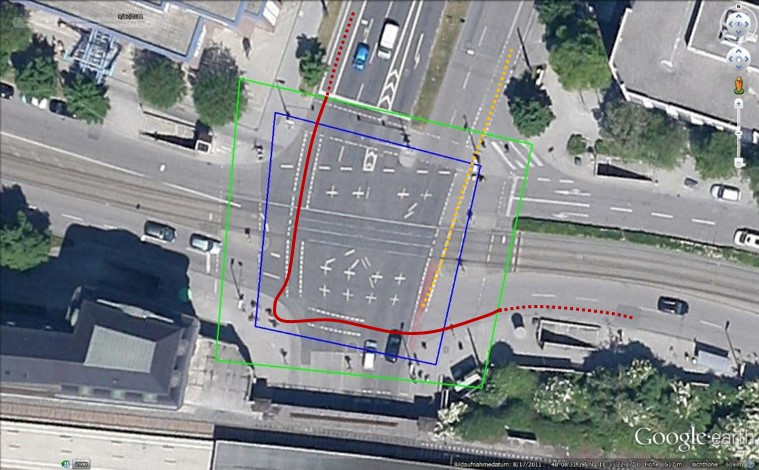

# RoadUserPathways
This project provides python code for clustering trajectory data extracted from videos. The results can be used to examine the unexpected tactics employed by cyclists, pedestrians, e-kick scooter users, scooter drivers and other users of mini and micro vehicles to cross inter-sections. Akin to desire lines, the output from this tool can help urban planners and traffic engi-neers create road infrastructure that serves the needs of users of sustainable modes of transport.

The following images display the clustered trajectories from cyclists crossing an intersection in Munich, Germany. On the left side, all clustered trajectories are shown (each color represents a cluster/type of pathways). On the right side, the centers of each cluster which represent the average shape of the pathway type with the number and percentage of cyclists observed using this type of pathway.

<p align="center">
  
  
</p>

If you use this code, please cite the paper: 

Kaths, H. A. (2023). Crossing intersections: A tool for investigating road user pathways. Environment and Planning B: Urban Analytics and City Science. https://doi.org/10.1177/23998083231215462

## Dependencies
- OpenCV
- trafficintelligence (from https://bitbucket.org/Nicolas/trafficintelligence/)
- sklearn
- shapely
- numpy
- matplotlib
- os
- pickle

## Workflow
<p align="center">
  
</p>

## Data
RoadUserPathways uses trajectory data and geometric information about road infrastructure to cluster trajectories into commonly used pathways. The necessary input data is:
- **Trajectory data** stored in an SQLite database as defined in the *Traffic Intelligence* project. Trajectories must describe the complete crossing maneouvre of the road user and cannot be disjointed in the middle of the video frame. Trajectories are described in a local coordinate system in which the coordinate point (0,0) is the upper left-hand corner of the video frame. Position coordinates are given in UTM meters and the velocity in m/frame. RoadUserPathways was developed using trajectories extracted from video data with 25 position coordinates per second (one per video frame). Trajectories with a lower frequency of observations will work as long as the shape of the crossing manoeuvre is captured. Code to convert trajectory data in other common formats (csv files from DataFromSky or inD) to the SQLite Traffic Intelligence format will be available soon. 

The road user types defined by *Traffic Intelligence* are used:
```
RoadUserTypes = {"unknown": 0, 
                "undefined": 0,
                "car": 1,
                "pedestrian": 2,
                "motorcycle": 3,
                "bicycle": 4,
                "truck_bus": 5}
```
- A **scale factor** relating the image pixels to UTM meters (meters/pixel).
- An **orthoimage** of the intersection.

## Trajectory pre-processing
Trajectory data can be pre-processed to increase the quality of the clustering results. This is particularly necessary if the trajectories are incomplete, meaning that they do not contain the entire crossing maneuver of the road user, and if the start/end position coordinates of the trajectories differ in space. 
These functionalities work as follows: 
1.	Incomplete trajectories can be removed using a polygon outlining the most important part of the intersection (or other part of the road infrastructure). This polygon is shown in blue below. To input this polygon on an areal image, the analyst should set the `--define_use` parameter to `define`. To use this polygon to filter out incomplete trajectories, the analyst should set the `--delete` parameter to `True`. 
2.	Trajectories can be trimmed to ensure comparability using a polygon that defines the area of interest or the starting/end points of the shortest trajectories. An example is shown in green below. To input this polygon on an areal image, the analyst should set the '--define_use' parameter to `define`. To use this polygon to trim trajectories (remove position coordinates at the start/end of the trajectory that fall outside the polygon), the analyst should set the `--trim` parameter to `True`.

<p align="center">
  
</p>

In the figure, the orange dashed trajectory will be filtered from the dataset because it starts within the blue polygon. The dashed sections of the red trajectory will be removed to ensure comparability.

The analyst also has the option to cluster trajectories from road users approaching from each arm of the intersection separately. To do this, the center point of the intersection and a point along each approach arm of the intersection can be selected from an areal image by setting the `--define_use` parameter to `define`. The approaches of interest can be input using the `--approaches` parameter. For example, if a T-intersection with no north approach is to be analyzed, `--approaches` should be set to `[‘E’,’S’,’W’]`. 

## Parameters
| Command-line Options      | Default value   | Description |
| ---                       | ---             | --- |
| `--dataset_dir`             | `"../data/"`      | Path to directory that contains the trajectory SQLite files and geometric information. |
| `--approaches`                 | `['N','E','S','W']` | List with labels for the arms of the intersection (eg. ['N','E','S','W']). |
| `--num_points`               | `20`            | The number of coordinate points taken from each trajectoriy to form the feature vector. | 
| `--traj_min_length`          | `100`               | The minimum length for trajectories to be included in clustering (in timesteps). | 
| `--num_SQ`       | `5`           | The maximum number of trajectory SQLite files from the dataset directory to include in clustering analysis. |  
| `--trim`        | `False`           | Use polygon to trim trajectories (recommended if starting and ending position points vary in space). | 
| `--delete`         | `False`           | Use polygon to delete trajectories starting or ending in polygon. | 
| `--road_user_types`  | `False`           | List with road user types to cluster (eg [1,4]) as defined by *Traffic Intelligence*  | 
| `--define_use`       | `False`           | Set to 'use' if geometry already defined, otherwise set to 'define'. | 
| `--cluster_omit`          | `2`           | Minimum number of trajectories in a cluster to include in output | 

## Notes about the output
The tool yields three main outputs:
- The number of pathway types used by road users
- A representative trajectory that characterizes the average shape of each pathway type
- The number and percentage of road users who use each pathway type

Users can regulate to what extent odd or irregular trajectories are included in the output using the parameter `--cluster_omit`. If this parameter is set to a larger number, only pathway types used by many cyclists will be included in the output. If this number is very low, all anomalies will also be included in the output. 

If a subset of the trajectories data from one approach arm is analysed, the identified clusters will differ from those emerging from clustering the whole dataset for the same approach. This is because the relative similarity of the trajectories is greater when all originate from the same arm of the intersection. Generally, if all the clusters from all arms are summed, the total number of clusters will be larger than the number of clusters resulting when all trajectories are analysed together. 

## Notes about Affinity Propagation
The expected clusters vary with regard to the number of observations in each cluster (cluster size) and the degree of similarity between observations in the same cluster (cluster density). Additionally, because the number of different pathways across the intersection is not known in advance, the number of clusters cannot be designated as an input to the algorithm. The data are expected to be globular, or convex, meaning that any line drawn in $d$ dimensional space between an observation and the cluster center, or between two observations in one cluster, is within the boundary of that cluster. Trajectory data is not always globular. However, in the context of an intersection, the movement patterns are relatively simple in their geometry. They do not exhibit the more complex shapes associated with trajectories from an entire route through the network, for example. Based on the attributes of the clustering problem and the availability of an openly available Python implementation (scikit-learn), the Affinity Propagation (Frey and Dueck, 2007) clustering algorithm is selected from the many available clustering algorithms. Affinity Propagation is a centroid-based clustering method, meaning that the clusters are built by measuring the distance of observation points from an assigned cluster centroid (referred to as an exemplar in Affinity Propagation). The algorithm rotates through trajectories as potential centroids and selects the set of centroid trajectories that results in the lowest overall distance between observation points and assigned cluster centroid. This is important for RoadUserPathways because the centroid (or exemplar) represents the desire line of each pathway type.

The Python scikit-learn implementation of Affinity Propagation (Pedregosa et al., 2011) is used to cluster the trajectory data in the $A^*$ matrix. The preference parameter describes the suitability of each observation to be used as an exemplar and influences the number of clusters that are produced. In RoadUserPathways, the multiple preference parameters are tested and the resulting clustering structure is evaluated using the average Silhouette Score $\bar{s}$. The preference parameter leading to the highest $\bar{s}$ is selected. If multiple preference parameters deliver the same $\bar{s}$, the one leading to the highest $\bar{s}$ and lowest number of clusters is selected.

The $A^*$ matrix format described above is the basic input for (nearly) all of the clustering methods included in scikit-learn. Therefore, although Affinity Propagation is implemented in RoadUserPathways and has been found to provide useful results, it is straightforward to switch to a different centroid-based clustering method included in scikit-learn, such as k-means (although with this method the number of clusters has to be specified by the analyst).

First, a qualitative comparison of the clusters obtained using Affinity Propagation, k-means and Mean Shift indicated that the best results were obtained with Affinity Propagation. In addition to the good results, a strong advantage of this algorithm is that the number of clusters is determined as an output of the algorithm and is not required as input, reducing the influence of the analyst on the number of pathway types identified. However, a more systematic assessment of clustering algorithms is necessary. It is possible that this algorithm will not cluster trajectories optimally in each case and the analyst should assess the clusters after running RoadUserPathways. 

## References
Frey BJ and Dueck D (2007) Clustering by passing messages between data points. Science 315(5814). American Association for the Advancement of Science: 972–976.

Gillies S (2022) Shapely. Creative Commons Attribution 3.0 United States License. Available at: https://shapely.readthedocs.io/en/stable/manual.html.

Jackson S, Miranda-Moreno L, St-Aubin P, et al. (2013) A Flexible, Mobile Video Camera System and Open Source Video Analysis Software for Road Safety and Behavioural Analysis. Transportation Research Record: Journal of the Transportation Research Board 2365: 90–98. DOI: http://dx.doi.org/10.3141/2365-12.

Pedregosa F, Varoquaux G, Gramfort A, et al. (2011) Scikit-learn: Machine learning in Python. the Journal of machine Learning research 12. JMLR. org: 2825–2830.

